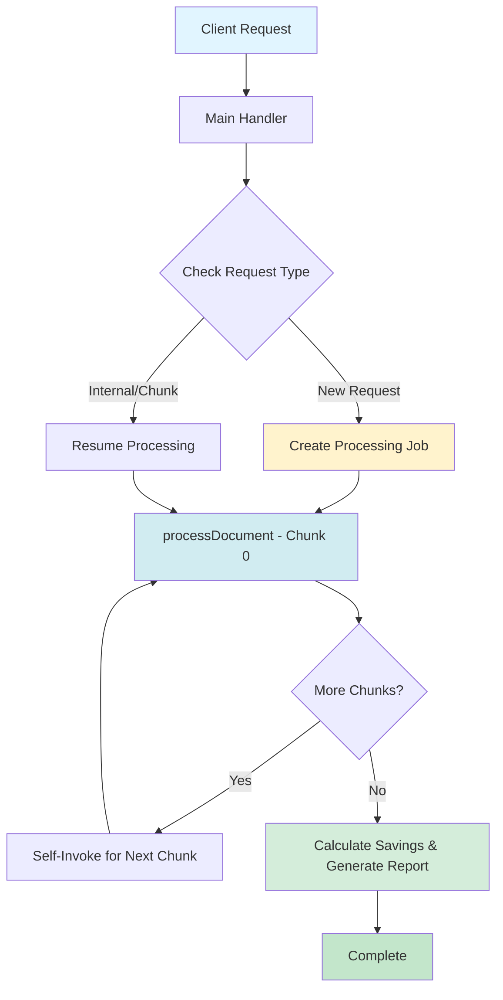

# Process-Document Function Flow

> **Note**: To view the Mermaid diagrams in VS Code, install the "Markdown Preview Mermaid Support" extension or view this file on GitHub.

## High-Level Overview



## Detailed Processing Flow

```
┌─────────────────────────────────────────────────────────────────────┐
│                     🎯 PROCESS-DOCUMENT FUNCTION                     │
└─────────────────────────────────────────────────────────────────────┘

┌─────────────────────────────────────────────────────────────────────┐
│  1️⃣  INITIALIZATION (Progress: 0-5%)                                │
├─────────────────────────────────────────────────────────────────────┤
│  • Receive submissionId from client                                 │
│  • Fetch submission details from database                           │
│  • Create processing_job record                                     │
│  • Build ProcessingContext                                          │
│  • Return immediately to client (async processing)                  │
└─────────────────────────────────────────────────────────────────────┘
                              ↓
┌─────────────────────────────────────────────────────────────────────┐
│  2️⃣  DOWNLOAD & PARSE (Progress: 5-15%) - CHUNK 0 ONLY             │
├─────────────────────────────────────────────────────────────────────┤
│  • Download file from storage URL                                   │
│  • Detect file type (CSV, Excel, PDF)                               │
│  • Parse document:                                                  │
│    - CSV: Parse with Papa Parse                                     │
│    - Excel: Parse with XLSX library                                 │
│    - PDF: Extract text with pdf-parse                               │
│  • Extract structured items with OpenAI GPT-4                       │
│  • Store metadata (total_items, headers, parsed_at)                 │
└─────────────────────────────────────────────────────────────────────┘
                              ↓
┌─────────────────────────────────────────────────────────────────────┐
│  3️⃣  VALIDATION (Progress: 15-20%) - CHUNK 0 ONLY                  │
├─────────────────────────────────────────────────────────────────────┤
│  • Validate extraction quality                                      │
│  • Check minimum data requirements:                                 │
│    ✓ Item identifier (name/SKU) present                             │
│    ✓ Quantity present                                               │
│    ✓ Price information present                                      │
│  • If validation fails → Stop and error                             │
│  • If validation passes → Continue                                  │
└─────────────────────────────────────────────────────────────────────┘
                              ↓
┌─────────────────────────────────────────────────────────────────────┐
│  4️⃣  CHUNKED MATCHING (Progress: 20-60%)                           │
├─────────────────────────────────────────────────────────────────────┤
│  CHUNK SIZE: 100 items per batch                                    │
│                                                                      │
│  For each chunk:                                                    │
│  ┌────────────────────────────────────────────────────────────┐    │
│  │ A. SEMANTIC SEARCH (AI-powered matching)                   │    │
│  │    • Extract search terms from item                        │    │
│  │    • Query master_products via embeddings                  │    │
│  │    • Score matches by similarity                           │    │
│  │    • Apply compatibility filters                           │    │
│  │                                                             │    │
│  │ B. EXACT/FUZZY MATCHING (Deterministic backup)            │    │
│  │    • Match by manufacturer_part_number                     │    │
│  │    • Match by vendor_sku                                   │    │
│  │    • Fuzzy match on item_name                              │    │
│  │                                                             │    │
│  │ C. OPTIMIZATION                                            │    │
│  │    • Check for higher-yield alternatives (toner/ink)       │    │
│  │    • Calculate Cost Per Page (CPP)                         │    │
│  │    • Suggest better options if available                   │    │
│  │                                                             │    │
│  │ D. SAVE TO DATABASE                                        │    │
│  │    • Insert matched_items records                          │    │
│  │    • Store match confidence & method                       │    │
│  │    • Track optimization recommendations                    │    │
│  └────────────────────────────────────────────────────────────┘    │
│                                                                      │
│  After chunk completion:                                            │
│    → If more items remaining: Self-invoke for next chunk            │
│    → If all items processed: Continue to savings calculation        │
└─────────────────────────────────────────────────────────────────────┘
                              ↓
┌─────────────────────────────────────────────────────────────────────┐
│  5️⃣  CALCULATE SAVINGS (Progress: 60-78%)                          │
├─────────────────────────────────────────────────────────────────────┤
│  • Fetch all matched items from database                            │
│  • For each item:                                                   │
│    - Normalize prices to per-each basis                             │
│    - Calculate current cost (user's price × quantity)               │
│    - Calculate ASE cost (our price × quantity)                      │
│    - Compute savings (current - ASE)                                │
│  • Calculate environmental impact:                                  │
│    - CO2 reduction from remanufactured cartridges                   │
│    - Plastic waste reduction                                        │
│    - Energy savings                                                 │
│  • Generate savings summary:                                        │
│    - Total items processed                                          │
│    - Items with savings                                             │
│    - Total cost savings ($)                                         │
│    - Average savings percentage (%)                                 │
│    - Environmental metrics                                          │
│  • VALIDATION: If total savings = $0 → Error                        │
└─────────────────────────────────────────────────────────────────────┘
                              ↓
┌─────────────────────────────────────────────────────────────────────┐
│  6️⃣  GENERATE PDF REPORT (Progress: 78-93%)                        │
├─────────────────────────────────────────────────────────────────────┤
│  • Build PDF with PDFKit library:                                   │
│    - Company branding & logo                                        │
│    - Customer information                                           │
│    - Executive summary                                              │
│    - Detailed line-item breakdown                                   │
│    - Savings analysis & visualizations                              │
│    - Environmental impact section                                   │
│    - Recommendations & next steps                                   │
│  • Upload PDF to Supabase Storage                                   │
│  • Generate public URL                                              │
└─────────────────────────────────────────────────────────────────────┘
                              ↓
┌─────────────────────────────────────────────────────────────────────┐
│  7️⃣  SAVE FINAL RESULTS (Progress: 93-100%)                        │
├─────────────────────────────────────────────────────────────────────┤
│  • Update processing_job:                                           │
│    - Set status = 'completed'                                       │
│    - Set progress = 100                                             │
│    - Store report_url                                               │
│    - Store final_results (savings summary)                          │
│  • Update document_submission:                                      │
│    - Link to completed job                                          │
│    - Store processing stats                                         │
│  • Mark completed_at timestamp                                      │
└─────────────────────────────────────────────────────────────────────┘
                              ↓
                     ✅ COMPLETE!
```

## Key Features

### 🔄 Chunked Processing
- **Why**: Prevents timeout errors on large files
- **How**: Processes 100 items per chunk, self-invokes for next batch
- **Benefit**: Can handle files with 1000+ line items

### 🎯 Multi-Strategy Matching
1. **Semantic Search** (AI-powered): Understands product descriptions
2. **Exact Matching**: Direct SKU/Part number matches
3. **Fuzzy Matching**: Handles typos and variations
4. **Optimization**: Suggests better alternatives

### 💰 Savings Calculation
- Normalizes all prices to per-each basis
- Compares apples-to-apples across different UOMs
- Validates minimum savings threshold
- Calculates environmental impact

### 🌱 Environmental Impact
- Tracks remanufactured vs OEM cartridges
- Calculates CO₂ reduction
- Measures plastic waste savings
- Quantifies energy efficiency gains

## Error Handling

```
┌─────────────────────────────────────────────┐
│  Error at any step triggers:               │
├─────────────────────────────────────────────┤
│  • Update job status to 'failed'           │
│  • Store error_message                     │
│  • Set completed_at timestamp              │
│  • User sees friendly error message        │
└─────────────────────────────────────────────┘
```

## Database Tables Used

- **document_submissions**: Customer info & file details
- **processing_jobs**: Job status & progress tracking
- **matched_items**: Individual line item matches
- **master_products**: Product catalog (22,000+ SKUs)
- **Storage**: File uploads & generated PDFs

## Performance Metrics

- **Parse Time**: ~2-5 seconds (varies by file size)
- **Matching**: ~0.5-1 second per item (with AI)
- **Savings Calc**: ~0.1 seconds per item
- **PDF Generation**: ~3-5 seconds
- **Total Time**: 30 seconds - 5 minutes (depending on file size)

